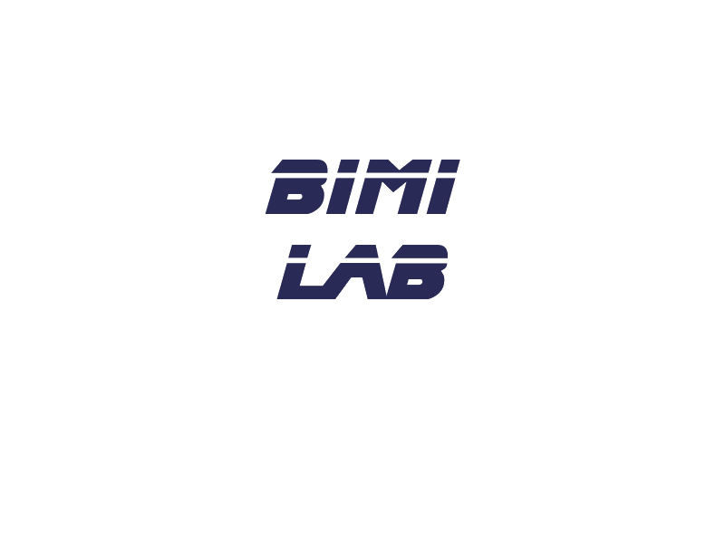

  

# 🔬 Bio-Inspired Machine Intelligence (BIMI) Lab @ the University of Michigan-Dearborn 

Welcome to the official GitHub Organization of the **BIMI**. Our research focuses on pushing the boundaries of **Artificial Intelligence and Machine Learning**, **Autonomous Vehicles**, and **Computational Neuroscience**.

---

## 🚀 Research Pillars
* **AI & ML:** Embodied Cognition for for Robotics.
* **Autonomous Vehicles:** Multimodal Models for Robotics.
* **Neural Dynamics:** Artificial Neural Network's Internal Dynamics.

---

## 📂 Repository Navigator
To help you find our work, we use the following naming conventions:
* `paper-*`: Official code for published research papers.
* `proj-*`: Ongoing research projects and internal tools.
* `tool-*`: General-purpose libraries and utilities developed by the lab.

---

## 🎓 Lab Members
| Name | Role | Research Interest | GitHub |
| :--- | :--- | :--- | :--- |
| **Jaerock Kwon** | Director | [Interest] | [@jrkwon](#) |
| Aws Khalil | Ph.D. Candidate | [Interest] | [@username](#) |
| Feeza Khan Khanzada | Ph.D. Candidate | [Interest] | [@username](#) |
| Jose Gonzalez-Belmonte | D.Eng | [Interest] | [@username](#) |
| Raghu Nallapati | D.Eng | [Interest] | [@username](#) |
| Ali Al-Bustami | Master's | [Interest] | [@username](#) |

---

## 📋 Guidelines for Members
If you are a new member of the lab, please refer to our **[Internal Wiki/Onboarding Guide]** for:
1.  **Code Standards:** Use our [Standard README Template](research-template).
2.  **Environment:** We prefer `Conda` or `Docker` for reproducibility.
3.  **Data Policy:** Never upload raw datasets or model weights >50MB to GitHub.

---

## 📬 Contact & Links
* 🌐 **Website:** bimi.jrkwon.com
* 📧 **Email:** jrkwon@umich.edu
* 📍 **Location:** ELB 2069, University of Michigan-Deaborn
* 🐦 **Twitter/X:** @jaerock\_ece
*    **LinkedIn** [BIMI](https://www.linkedin.com/company/umd-bimi/)

---
*Managed by the BIMI Technical Committee.*
